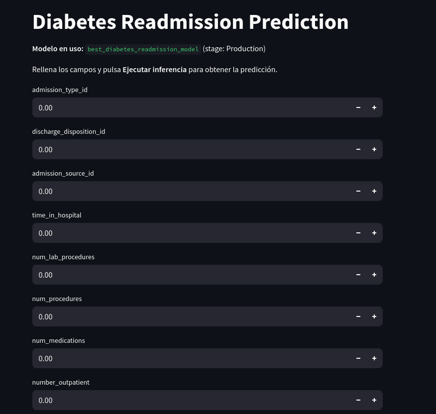
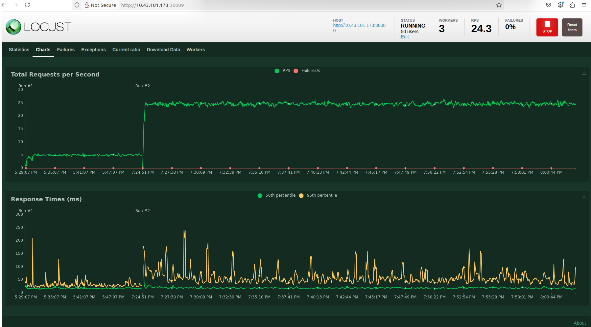
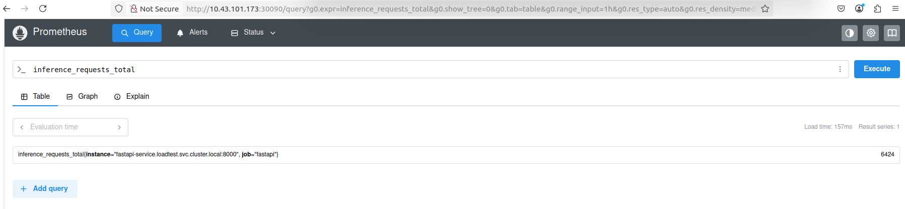
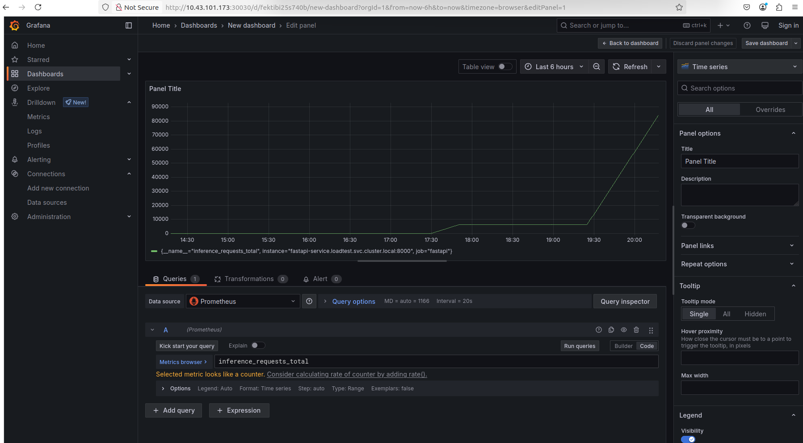

# 🚀 Servicios en Servidor3

## 📋 Descripción General

Este README describe en detalle cómo están organizados y desplegados los servicios en Servidor3 dentro del proyecto PROYECTO3-MLOPS-KUBERNETES.

## 🏗️ Arquitectura

El proyecto está desplegado a través de Kubernetes con los siguientes componentes:

### 🔹 API de Inferencia (FastAPI)

Servicio que expone el modelo de machine learning para realizar predicciones en tiempo real.

- **Tecnología**: FastAPI
- **Funcionalidad**: Realiza inferencia utilizando el mejor modelo clasificado en producción
- **Métricas**: Integración con Prometheus para monitorización
- **Endpoints**:
  - `/predict`: Realiza predicciones basadas en los datos de entrada
  - `/health`: Verifica el estado del servicio
  - `/metrics`: Expone métricas para Prometheus

### 🔹 Interfaz de Usuario (Streamlit)

Aplicación web que permite a los usuarios interactuar con el modelo de forma intuitiva.

- **Tecnología**: Streamlit
- **Funcionalidad**: Proporciona una interfaz gráfica para introducir datos y visualizar predicciones
- **Integración**: Se comunica con la API de FastAPI para realizar predicciones

### 🔹 Pruebas de Carga (Locust)

Herramienta para realizar pruebas de rendimiento sobre la API de inferencia.

- **Tecnología**: Locust
- **Funcionalidad**: Simula múltiples usuarios concurrentes para evaluar el rendimiento y la escalabilidad
- **Arquitectura**: Implementación master-worker para distribuir la carga


### 🔹 Observabilidad (Prometheus + Grafana)

Stack de monitorización para recolectar y visualizar métricas de rendimiento.

- **Prometheus**: Recolecta métricas de la API de inferencia
- **Grafana**: Visualiza las métricas recolectadas en dashboards personalizables

**Características de Prometheus:**
- Recolección de métricas mediante scraping HTTP
- Almacenamiento eficiente de series temporales
- Lenguaje de consulta potente (PromQL)
- Alertas configurables
- Integración con múltiples exporters

**Características de Grafana:**
- Dashboards personalizables y reutilizables
- Soporte para múltiples fuentes de datos
- Visualizaciones avanzadas (gráficos, tablas, heatmaps)
- Anotaciones y alertas
- Compartición y exportación de dashboards

## 🛠️ Despliegue

### Requisitos Previos

- Kubernetes (MicroK8s)
- Docker
- Registro de imágenes local (puerto 32000)
- MLflow (para gestión del modelo)

### Pasos de Despliegue

#### 1. Crear Namespace

```bash
sudo microk8s kubectl create namespace loadtest
```

#### 2. API de Inferencia (FastAPI)

```bash
# Situarse en el directorio de la API
cd api

# Construir y subir la imagen
docker build -t localhost:32000/fastapi-service:latest .
docker push localhost:32000/fastapi-service:latest

# Desplegar en Kubernetes
sudo microk8s kubectl -n loadtest apply -f k8s/fastapi-deployment.yaml
```

#### 3. Interfaz de Usuario (Streamlit)

```bash
# Situarse en el directorio de Streamlit
cd streamlit

# Construir y subir la imagen
docker build -t localhost:32000/streamlit-ui:latest .
docker push localhost:32000/streamlit-ui:latest

# Desplegar en Kubernetes
sudo microk8s kubectl -n loadtest apply -f k8s/streamlit-deployment.yaml
```

#### 4. Pruebas de Carga (Locust)

```bash
# Situarse en el directorio de Locust
cd locust

# Construir y subir la imagen
docker build -t localhost:32000/locust:latest .
docker push localhost:32000/locust:latest

# Desplegar en Kubernetes
sudo microk8s kubectl -n loadtest apply -f k8s/locust-k8s.yaml
```

#### 5. Observabilidad (Prometheus + Grafana)

```bash
# Situarse en el directorio de observabilidad
cd observability/k8s

# Crear el namespace y desplegar
sudo microk8s kubectl apply -f observability.yaml
```

## 🔍 Verificación del Despliegue

Verificar que todos los servicios estén correctamente desplegados:

```bash
# Verificar pods
sudo microk8s kubectl -n loadtest get pods
sudo microk8s kubectl -n observability get pods

# Verificar servicios
sudo microk8s kubectl -n loadtest get svc
sudo microk8s kubectl -n observability get svc
```

## 🌐 Acceso a los Servicios

- **API de FastAPI**: http://[IP-DEL-NODO]:30080
  - Documentación interactiva: http://[IP-DEL-NODO]:30080/docs
  - Métricas: http://[IP-DEL-NODO]:30080/metrics

  


- **Interfaz Streamlit**: http://[IP-DEL-NODO]:30081
  - Interfaz principal para usuarios finales
  - No requiere conocimientos técnicos para su uso

  


- **Locust**: http://[IP-DEL-NODO]:30009
  - Interfaz de configuración de pruebas
  - Visualización de resultados en tiempo real
  - Exportación de informes

  

- **Prometheus**: http://[IP-DEL-NODO]:30090
  - Explorador de métricas
  - Configuración de alertas
  - Consultas PromQL

  


- **Grafana**: http://[IP-DEL-NODO]:30030
  - Credenciales por defecto: admin/admin
  - Dashboards preconfigurados
  - Personalización de visualizaciones



## 📝 Estructura del Proyecto

```
.
├── api/                    # Servicio de API con FastAPI
│   ├── app/                # Código de la aplicación
│   │   ├── main.py         # Punto de entrada de la API
│   │   └── requirements.txt # Dependencias
│   ├── Dockerfile          # Configuración para la imagen Docker
│   └── k8s/                # Manifiestos de Kubernetes
│       └── fastapi-deployment.yaml
├── streamlit/              # Interfaz de usuario con Streamlit
│   ├── app/                # Código de la aplicación
│   │   ├── main.py         # Punto de entrada de la UI
│   │   └── requirements.txt # Dependencias
│   ├── Dockerfile          # Configuración para la imagen Docker
│   └── k8s/                # Manifiestos de Kubernetes
│       └── streamlit-deployment.yaml
├── locust/                 # Pruebas de carga con Locust
│   ├── locustfile.py       # Configuración de pruebas
│   ├── Dockerfile          # Configuración para la imagen Docker
│   └── k8s/                # Manifiestos de Kubernetes
│       └── locust-k8s.yaml
└── observability/          # Monitorización con Prometheus y Grafana
    ├── prometheus.yml      # Configuración de Prometheus
    └── k8s/                # Manifiestos de Kubernetes
        ├── grafana-datasources.yaml
        └── observability.yaml
```

## 🔄 Flujo de Trabajo

1. **Preparación de datos**: Los datos del paciente se introducen a través de la interfaz de Streamlit o se envían directamente a la API.

2. **Procesamiento de la solicitud**: 
   - La interfaz de Streamlit valida los datos y los envía a la API de FastAPI.
   - La API valida nuevamente los datos utilizando Pydantic.

3. **Inferencia del modelo**:
   - La API carga el modelo desde MLflow Registry.
   - Se realiza la predicción utilizando los datos procesados.
   - Se registran métricas de rendimiento en Prometheus.

4. **Respuesta al usuario**:
   - El resultado de la predicción se devuelve a la interfaz de Streamlit.
   - Se presenta al usuario de forma clara y comprensible.

5. **Monitorización continua**:
   - Prometheus recolecta métricas de rendimiento de la API.
   - Grafana visualiza estas métricas en dashboards personalizados.
   - Se generan alertas en caso de anomalías.

6. **Pruebas de carga**:
   - Locust permite realizar pruebas de rendimiento programadas o bajo demanda.
   - Los resultados ayudan a optimizar la configuración y el escalado.

## 🔧 Mantenimiento y Escalabilidad

### Actualización del Modelo

1. Entrenar y registrar un nuevo modelo en MLflow
2. Actualizar la referencia en la configuración de la API
3. Reconstruir y desplegar la imagen de la API

### Escalado Horizontal

Kubernetes permite escalar los componentes según la demanda:

```bash
# Escalar la API a 3 réplicas
sudo microk8s kubectl -n loadtest scale deployment fastapi-service --replicas=3

# Escalar workers de Locust a 5
sudo microk8s kubectl -n loadtest scale deployment locust-worker --replicas=5
```

### Backup y Restauración

```bash
# Backup de configuraciones
sudo microk8s kubectl -n loadtest get all -o yaml > loadtest-backup.yaml
sudo microk8s kubectl -n observability get all -o yaml > observability-backup.yaml

# Restauración
sudo microk8s kubectl apply -f loadtest-backup.yaml
sudo microk8s kubectl apply -f observability-backup.yaml
```

## 👥 Contribuciones

Para contribuir al proyecto:

1. Haz un fork del repositorio
2. Crea una rama para tu funcionalidad (`git checkout -b feature/nueva-funcionalidad`)
3. Realiza tus cambios y haz commit (`git commit -am 'Añadir nueva funcionalidad'`)
4. Sube los cambios a tu fork (`git push origin feature/nueva-funcionalidad`)
5. Crea un Pull Request

## 📄 Licencia

Este proyecto está bajo la Licencia MIT - ver el archivo [LICENSE](LICENSE) para más detalles.

## 👤 Autor

Luis Fernandez
- 💼 [LinkedIn](https://www.linkedin.com/in/luis-carlos-fernandez-vargas-64466768)
